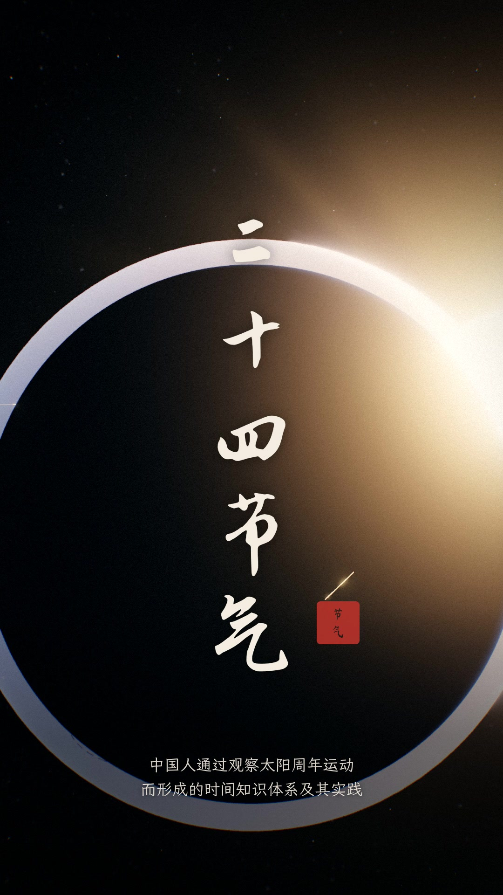

# 《二十四节气》· 3D 竖屏短片



竖屏 1080×1920，24 fps，3 分 48 秒。地球每走 15°，大地换一种表情。

| 文件 | 说明 |
|---|---|
| `成片/二十四节气_完整版.mp4` | 全片（约 86 MB） |
| `成片/二十四节气_上篇.mp4` | 序章 + 春 + 夏（1:52，< 30 MB，可直接发公众号） |
| `成片/二十四节气_下篇.mp4` | 秋 + 冬 + 尾声（1:55，< 30 MB） |
| `成片/二十四节气_原声.m4a` | 原声（旁白 + 配乐 + 音效） |
| `facts.md` | 史实、诗句出处、读音核对 |
| `check_report.md` | 自检结果与自我优化记录 |
| `storyboard.csv` / `beat_grid.json` | 分镜表与拍点网格 |
| `缩略图拼版.jpg` | 37 镜缩略图 |

## 结构

**序章** 日地轨道：一年 360°，每 15° 切一刀，24 个刻度逐一点亮，每亮一个响一声钟琴 → **片名** → **卷一·春 / 卷二·夏 / 卷三·秋 / 卷四·冬**，每个节气一镜 → **尾声** 转回立春，《淮南子》，2016 年列入人类非遗。

贯穿全片的核心机制是**黄道即时钟**：
- 左下角的黄道表盘、太阳黄经、太阳直射纬度、公历日期随镜头实时变化。直射纬度按 δ = arcsin(sin 23.44° · sin λ) 计算。
- 春分、夏至、秋分、冬至四镜是贴近地球的 3D 特写：地轴倾斜 23.44°，金色光柱照在直射点上，标出赤道和南北回归线。
- 其余 20 个节气是同一座程序化 3D 山水（湖、山、田、亭、舟、树），每个节气换一套天光、植被与物候：立春冰融，雨水落雨，惊蛰春雷与桃花，清明烟雨，谷雨落英，小满青麦，芒种半麦半秧，小暑荷塘，大暑萤火，立秋落叶，处暑鹰旋，白露月夜露珠，寒露雁阵与金菊，霜降枫桥渔火，立冬薄冰，小雪亭中灯火，大雪孤舟蓑笠翁，小寒鹊归与红梅，大寒风雪中天光转暖。
- 每镜配三候（竖排）、一联古诗（逐字显现）和黄经印章。

## 怎么做的

全部由代码生成：

| 环节 | 实现 |
|---|---|
| 3D 画面 | three.js（`source/film/`），无头 Chromium + SwiftShader 逐帧渲染；地球用 NASA Blue Marble 昼夜贴图（取自 npm 包 three-globe），平面反射水面，Unreal 泛光，水墨晕开转场，ACES 调色 |
| 书法排版 | 马善政楷书（节气名、诗）、直芒行书（片名）、霞鹜文楷（字幕） |
| 旁白 | zhtts 离线 TTS（FastSpeech2 + MB-MelGAN），多音字替换后逐字核对音素 |
| 配乐 | mido 写 MIDI，FluidSynth 分轨渲染。五声调式：春 D 宫（笛），夏 G 宫（排箫、竖琴），秋 E 羽（胡琴、古筝），冬 B 羽（尺八、钢片琴） |
| 音效 | numpy DSP 合成：风、雨、春雷、鸟鸣、雁鸣、蝉、蟋蟀、冰裂、灯火噼啪、麦浪、笔锋转场声 |
| 混音 | 自适应侧链（旁白比背景高 13 dB）+ 自写前视限幅器，母带 −14 LUFS |
| 自检 | 拍点、可懂度、响度、阅读时长、文字框重叠、逐镜拼版复看 |

## 重新生成

```bash
cd source/film && npm install          # three、字体、three-globe 贴图
mkdir -p tex && cp node_modules/three-globe/example/img/{earth-day.jpg,earth-night.jpg,earth-water.png,night-sky.png} \
   node_modules/three-globe/example/clouds/clouds.png tex/
cp node_modules/three/build/three.module.js three.js && cp node_modules/three/build/three.core.js .
cd ../proj
python3 tts.py && python3 grid.py && cp beat_grid.json ../film/   # 旁白需要 zhtts + tensorflow-cpu 2.15.1（独立 venv）
python3 score.py && python3 mix.py                                # 配乐 + 混音（需要 fluidsynth、FluidR3_GM.sf2）
cd ../film && python3 -m http.server 8766 &                       # 渲染页面
python3 render.py 1                                               # 逐镜渲染到 segs/（约 4–5 小时）
cd ../proj && python3 assemble.py                                 # 拼接 + 编码
```

如果要修改某一镜，用 `python3 render.py 1 t05` 只重渲那一镜，再运行 `assemble.py`。
