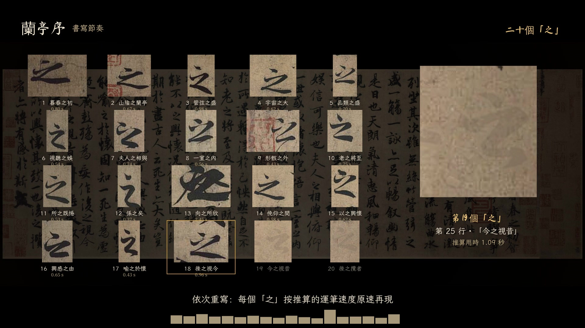

# 《兰亭序》书写节奏



横屏 1920×1080（2.39:1 宽银幕，上下黑边放标题和节奏条），24 fps，1 分 43 秒。纯音乐加笔声，没有旁白。

按运笔速度还原神龙本的书写过程：行气就是节拍。全文 20 个"之"逐一重写、对照，最后叠成一影。

| 文件 | 说明 |
|---|---|
| `成片/兰亭序_书写节奏.mp4` | 成片 |
| `成片/兰亭序_原声.m4a` | 原声（配乐 + 笔声） |
| `二十个之_数据.json` | 20 个"之"的行号、推算用时、断笔数、墨迹面积、在卷上的坐标 |
| `facts.md` | 史实出处与书写复原方法 |
| `check_report.md` | 自检结果与优化记录 |
| `抽帧拼版.jpg` | 各段抽帧 |

## 段落

| 时间 | 内容 |
|---|---|
| 0:00–0:07 | 空卷（只留历代印章），片名 |
| 0:07–0:26 | 第 1 行"永和九年歲在癸丑暮春之初會"以 1.4 倍推算速度逐笔写出，镜头跟笔 |
| 0:26–0:55 | 加速写完全卷，最高约 30 倍；末行收慢到接近原速。底栏每字一根柱，高度是推算用时 |
| 0:55–1:03 | 20 个"之"在卷上逐一亮起，飞入 5×4 网格 |
| 1:03–1:27 | 依次按推算的原速重写每个"之"，右侧放大，标出行号、上下文和用时 |
| 1:27–1:35 | 20 个"之"按墨迹重心叠成一影，引何延之《兰亭记》"变转悉异，遂无同者" |
| 1:35–1:43 | 回到全卷：行氣即節拍 |

## 方法

详见 `facts.md`。概括来说：
- 从神龙本全卷图逐字切分出 324 字，20 个"之"逐个人工核对；
- 按笔画宽度推算运笔速度：牵丝快，重按慢；
- 沿骨架做方向延续追踪，推出笔顺和每个墨点被写下的时刻；
- WebGL 着色器按这张时间图逐帧显影；
- 笔声音量由每刻新落墨的面积决定，音色由笔宽决定；
- 配乐用 D 羽调五声，每字起笔弹一声古筝。

推算结果用来呈现相对节奏，**不是真实的书写记录**。片尾已注明。

## 重新生成

```bash
cd source
# 需要：scroll.jpg（见 facts.md 的图像来源）、numpy/scipy/opencv/scikit-image/scikit-fmm、fluidsynth + FluidR3_GM、playwright + chromium
python3 seg.py && python3 fix.py          # 逐字切分 + 人工校正
python3 prep.py                            # 运笔速度 → 笔顺 → 时间图
python3 blank2.py && python3 tmapfill.py   # 空白卷面 + 时间图扩展到墨晕
python3 plan.py                            # 分镜显示列表 → film/film.json
python3 audio.py                           # 配乐 + 笔声 + 母带 → mix.wav
cd film && python3 -m http.server 8770 & python3 render.py   # 逐帧渲染（约 13 分钟）
```
