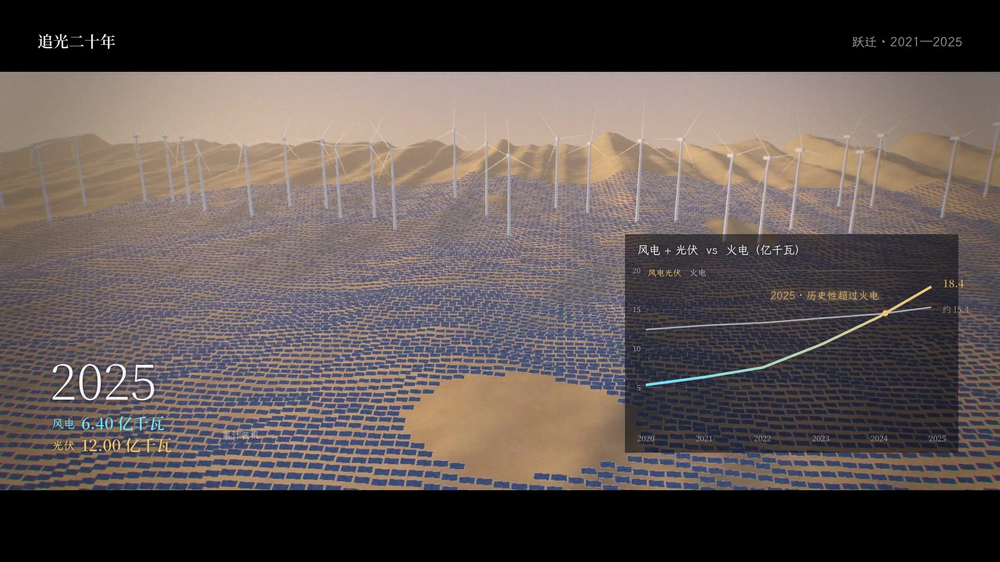

# 追光二十年

两分钟三维短片：中国新能源 2005—2025 的历程，以及 2026—2030 的走向。
横屏 1920×1080（2.39:1 宽银幕，上下黑边放标题、数据与字幕），24 fps，2 分 02 秒。旁白、配乐、音效齐全。

| 文件 | 说明 |
|---|---|
| `成片/追光二十年.mp4` | 成片（高码率） |
| `成片/追光二十年_原声.m4a` | 原声 |
| `facts.md` | 全部数字及出处 |
| `check_report.md` | 自检结果 |
| `抽帧拼版.jpg` | 各段抽帧 |
| `source/` | 场景、时间轴、配乐、混音、旁白源码 |

## 段落

| 时间 | 场景 | 内容 |
|---|---|---|
| 0:00–0:15 | 夜半球的地球 | 片名。2005 年：风电 126 万千瓦，光伏几乎为零；《可再生能源法》通过 |
| 0:15–0:45 | 点阵地形图 | 年份从 2005 走到 2020，西部风光基地的光柱按累计装机逐年长出，特高压线把电送往东部城市；2020 年"双碳"承诺 |
| 0:45–1:05 | 戈壁光伏 + 风机阵列 | 2020→2025，光伏板铺满沙丘，风电光伏 5.3 亿 → 18.4 亿千瓦，曲线越过火电 |
| 1:05–1:20 | 夜晚城市 | 车流由橙（燃油）变青（电动），渗透率环形图走到 47.9% |
| 1:20–1:40 | 黎明城市（未来五年） | 屋顶光伏逐片点亮，停着的车给电网回送电（V2G），储能集装箱亮起；四张 2030 目标卡片 |
| 1:40–2:02 | 地球日面 | 从中国射向世界的光弧；近 60% / 80% 以上 / 约 1.3 万亿元；片尾"从追光，到造光" |

## 做法

- 三维：three.js 在无头 Chromium（SwiftShader）中逐帧渲染。后期链为转场合成、泛光、ACES 调色、色差、暗角、颗粒。
- 地图：只用高程点阵，不画国界。光柱数量正比于当年全国累计装机，位置是主要基地的示意。
- 数据层：2D canvas 叠加。年份计数器、装机读数、"风光 vs 火电"曲线、新能源车渗透率环形图、2030 目标卡片都由 `data.json` 驱动。
- 旁白：zhtts 合成。多音字（为零、历史性地、铺满等）逐个核对了音素。
- 配乐：96 BPM，D 大调。用 MIDI 写成，由 FluidSynth 渲染，章节依次为：开场 → 增长 → 跃迁 → 电动化 → 未来 → 世界 → 收束。里程碑处（2020、2025 越线、世界段）放太鼓和低频冲击。
- 音效：地球段为太空底噪；地图段为特高压电流声；戈壁段为风声和风机扫掠；城市段为环境声；V2G 段为电火花。转场配呼啸声。
- 混音：人声链加自适应侧链闪避，母带 −14 LUFS，真峰值 ≤ −1 dBTP。

2026—2030 的数字是规划目标；火电 2025 年装机为约数。详见 `facts.md`。
